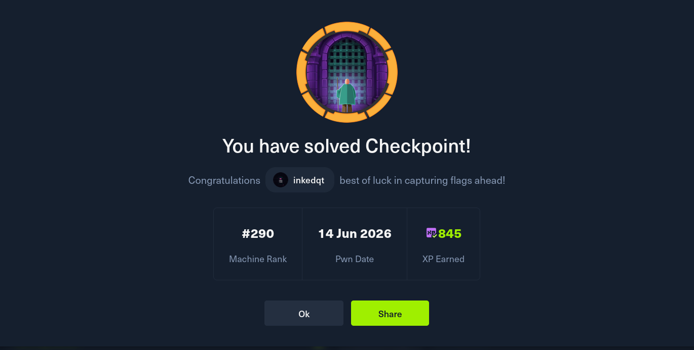

# ⚛️ Checkpoint

> **Difficulty:** Medium | **OS:** Windows | **Release:** HTB Season 11

Checkpoint is a Windows Active Directory box that chains together three distinct phases: recovering a deleted AD object to gain new access, abusing a writable SMB share to deliver a malicious VS Code extension and get a foothold, then exploiting delegated Managed Service Account (dMSA) permissions in their post-patch "mutual pairing" form to extract a service account credential — and finally pivoting through a VM backup share to perform memory forensics and recover the Administrator hash.

---

## 📸 Proof

---

## 🧠 Concepts Covered

- **AD Deleted Object (Tombstone) Recovery** — restoring an OADEL object via LDAP write primitives to resurrect an account
- **Password Spraying** — testing recovered accounts against a common credential pattern
- **VS Code VSIX Supply Chain** — crafting a malicious `.vsix` extension that executes on activation and placing it in a writable network share watched by a developer
- **BloodHound / Rusthound** — remote AD collection and ACL path discovery
- **GenericWrite Abuse** — identifying and exploiting write access to a target AD object
- **Shadow Credentials (blocked)** — understanding why `msDS-KeyCredentialLink` + PKINIT can fail on certain DCs and recognising the dead end early
- **BadSuccessor / BetterSuccessor (dMSA)** — the post-patch delegated MSA attack requiring mutual pairing on both the dMSA and superseded account objects via SharpSuccessor
- **KERB-DMSA-KEY-PACKAGE parsing** — extracting the superseded account's previous NTLM key from Rubeus debug output
- **Pass-the-Hash via WinRM** — authenticating as a service account using a recovered NT hash
- **VMware Memory Forensics** — mounting a `.vmem` snapshot in Volatility 3 and running `windows.registry.hashdump` to recover local SAM hashes

---

## 💡 Hints (No Spoilers)

**Foothold**
- Enumerate SMB shares carefully — one exists specifically for a developer workflow. Think about what that workflow might automatically load.
- AD isn't static. Objects that have been removed may still be recoverable if you have the right write primitive. Check what you can actually write to in the directory, not just what's visible.

**User**
- Once you can write to that developer share, think about what file format is automatically loaded when a developer opens their editor. You can craft one from scratch.
- A simple password pattern repeat is worth trying on any account you restore.

**Root**
- BloodHound will show you a write relationship on a service account. The obvious path from `GenericWrite` may be blocked by DC configuration — don't assume it'll work, test it and move on if it doesn't.
- Research the dMSA / BetterSuccessor attack. The patched version requires writing attributes on *both* the new dMSA object *and* the superseded account — one-sided writes no longer work.
- Once you have the service account, think about what privileged share you saw earlier and couldn't access. Memory files have a specific extension that Volatility handles natively.

---

## 📚 Useful Reading

- [BetterSuccessor — Altered Security](https://www.alteredsecurity.com/post/bettersuccessor) — the patched dMSA mutual-pairing attack this box is built around
- [SharpSuccessor](https://github.com/Flangvik/SharpSuccessor) — C# tool that automates the dMSA creation and pairing
- [bloodyAD](https://github.com/CravateRouge/bloodyAD) — LDAP write primitive tool used for tombstone restore and AD manipulation
- [Whisker](https://github.com/eladshamir/Whisker) — Shadow Credentials tool (useful to understand why it fails here)
- [Volatility 3](https://github.com/volatilityfoundation/volatility3) — `windows.info` and `windows.registry.hashdump` are the key plugins

---

*This box is part of HTB Season 11.*
