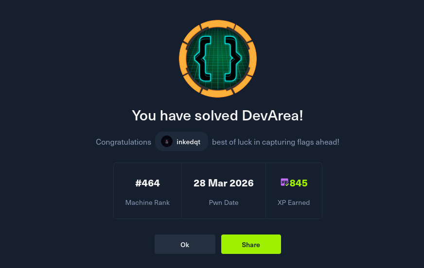

# 🛠️ DevArea

> **Difficulty:** Medium | **OS:** Linux | **Release:** HTB Season 10

A Linux developer box with a surprisingly long chain for Medium difficulty. Foothold requires you to reverse a JAR, find an ancient-but-working SOAP endpoint, and abuse a SSRF primitive that's been around since 2022. Getting to root involves forging a Flask session cookie and chaining two hops through a deliberately restricted sudo command. Each step is gated by something you found in the previous one.

---

## 📸 Proof

---

## 🧠 Concepts Covered

- Anonymous FTP enumeration
- Java JAR decompilation with JADX
- SOAP/WSDL endpoint enumeration
- CVE-2022-46364 — Apache CXF XOP/MTOM `xop:Include` arbitrary file read
- Systemd service file credential exposure
- CVE-2025-54123 — Hoverfly middleware RCE via command injection
- Flask session cookie forging (leaked secret key)
- Web application regex filter bypass for command injection
- Double symlink chain to bypass sudo path restrictions
- SSH private key exfiltration via read primitive

---

## 💡 Hints (No Spoilers)

**Foothold**
- Anonymous FTP has a JAR. Decompile it — the WSDL endpoint and action names are in the source.
- The CXF version is old. Look at what `xop:Include` does when the `href` is a `file://` URI. You don't get a shell from this, but you get arbitrary file read.
- Use that file read to find what's running internally. Systemd service files and app configs will tell you about other services.
- One of those services has a CVE this year involving its middleware execution endpoint.

**User**
- Once you're `dev_ryan`, look for a web dashboard running locally. Find a way to authenticate to it.
- The secret key is somewhere readable. Flask session cookies are just signed JWTs — forge one.
- The command execution endpoint has input validation. The validation isn't complete. Think about what characters let you chain commands without a literal slash or dot.

**Root**
- You'll escalate twice. First get a shell as the service user, then read the root flag (or key) through the sudo log viewer.
- The sudo command follows symlinks. Two hops through symlinks can redirect the final read to anywhere on the filesystem.

---

## 📚 Useful Reading

- CVE-2022-46364 — Apache CXF SSRF/file read via XOP MTOM
- CVE-2025-54123 — Hoverfly v1/api/v2/hoverfly/middleware command injection
- Flask session cookie structure and the `flask-unsign` tool
- `ss -lntp` — finding locally bound services
- Symlink chains and how `sudo` resolves file arguments
