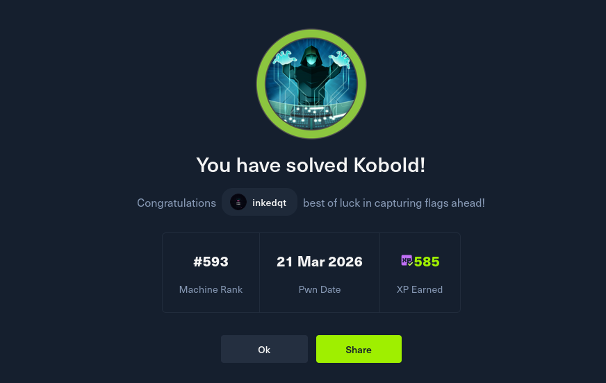

# 🪄 Kobold

> **Difficulty:** Easy | **OS:** Linux | **Release:** HTB Season 10

A Linux box running a couple of containerised services that do a lot of trusting of each other. Getting in is a single CVE away — once you're inside, the path to root is really just a story about what happens when you put a privileged Docker socket somewhere users can reach it. Tidy chain, nothing too esoteric.

---

## 📸 Proof

---

## 🧠 Concepts Covered

- Virtual host enumeration
- CVE research and exploitation (pre-auth RCE)
- CVE-2026-23744 — MCPJam unauthenticated RCE via `/api/mcp/connect`
- PrivateBin template-switching LFI technique
- Credential recovery from application config files
- Docker container enumeration and escape via bind-mount
- Privileged container abuse for host root access

---

## 💡 Hints (No Spoilers)

**Foothold**
- There's more than one virtual host. Find the MCP one.
- The MCP server software has a pre-auth CVE from this year. The endpoint name is in the CVE description.
- You don't need credentials, you don't need to enumerate users first — the vulnerability hands you execution directly.

**User / Container**
- Once inside, look at what other services are reachable from the container. There's a paste service on another vhost.
- PrivateBin has a template parameter. What happens if you point it somewhere that already has PHP-interpretable content?
- Read the application config. Credentials written there probably work somewhere else on the box.

**Root**
- Log into the admin panel with what you found. Admins can create containers.
- A container that mounts `/` from the host with read-write access is not a container at all.

---

## 📚 Useful Reading

- CVE-2026-23744 — MCPJam MCP server pre-auth RCE
- PrivateBin source — template parameter handling
- Docker bind mounts and privileged container escape
- Arcane Docker UI documentation
