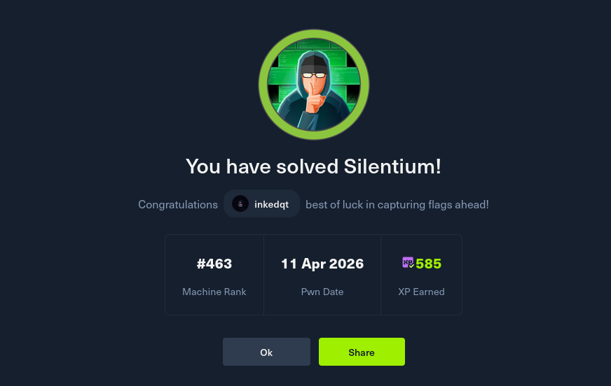

# 🤫 Silentium

> **Difficulty:** Easy | **OS:** Linux | **Release:** HTB Season 10

A Linux box built around AI workflow tooling. Two Flowise CVEs chain together to give you code execution inside a container, and a leaked environment variable hands you SSH access to the host. Root is a Gogs CVE that abuses symlink handling to overwrite a git config and inject shell commands via the `sshCommand` option. Each step is a current-year CVE — good box for practicing against recently-disclosed vulnerabilities.

---

## 📸 Proof

---

## 🧠 Concepts Covered

- Virtual host enumeration
- CVE-2025-58434 — Flowise forgot-password `tempToken` disclosure in JSON response
- Account takeover via password reset token
- CVE-2025-59528 — Flowise CustomMCP node `Function()` eval RCE
- Docker container enumeration and environment variable credential harvesting
- CVE-2025-8110 — Gogs `PutContents` API symlink path traversal
- Git `core.sshCommand` injection for privilege escalation

---

## 💡 Hints (No Spoilers)

**Foothold**
- There's a staging subdomain running Flowise. Check the version.
- The forgot-password endpoint returns more than it should — look at the raw JSON response, not just what the UI shows you.
- That token is enough to reset the password without knowing the old one.
- Once you're an admin, look at what the CustomMCP node type does with the code you give it. `Function()` is eval by another name.

**User**
- You're root inside a Docker container. Environment variables are a classic place to look for credentials.
- Try that password for the SSH user on the host.

**Root**
- There's a git service running locally. Register an account and look for a path traversal CVE against the version running.
- The traversal lets you write to files inside a repo. Think about which git config option lets you inject shell commands, and what triggers it.

---

## 📚 Useful Reading

- CVE-2025-58434 — Flowise password reset token disclosure
- CVE-2025-59528 — Flowise CustomMCP code execution
- CVE-2025-8110 — Gogs PutContents symlink traversal
- Git `core.sshCommand` — what it does and when it fires
- Docker environment variable enumeration (`env`, `/proc/1/environ`)
